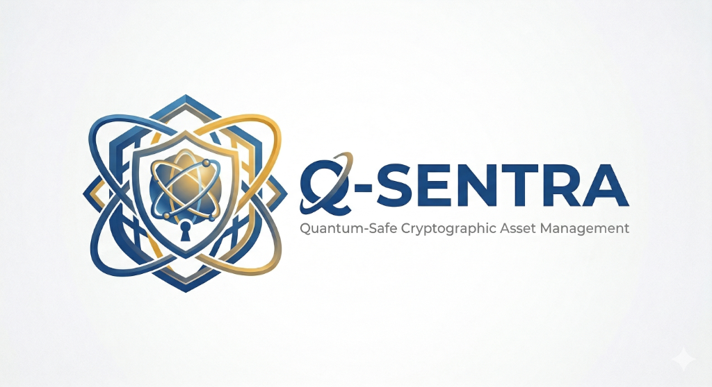

<p align="center">
  
</p>

<h1 align="center">Q-Sentra — Quantum-Safe Cryptographic Security Platform</h1>

<p align="center">
  <strong>AI-assisted Post-Quantum Cryptography (PQC) readiness, cryptographic asset discovery, risk scoring, CBOM generation, and remediation for banking-grade environments.</strong>
</p>

<p align="center">
  <a href="https://github.com/YeshwanthRajSelvaraj/Q-Sentra_PNB" target="_blank" rel="noreferrer">
    
  </a>
  
  
  
  
  
  
</p>

<p align="center">
  <a href="#-why-q-sentra">Why Q-Sentra</a> •
  <a href="#-key-capabilities">Capabilities</a> •
  <a href="#-architecture">Architecture</a> •
  <a href="#-quickstart">Quickstart</a> •
  <a href="#-api">API</a> •
  <a href="#-security">Security</a>
</p>

---

## 🧭 Context

Quantum-capable adversaries threaten long-lived confidentiality, signatures, and trust chains across enterprise banking systems. **Q‑Sentra** is a full‑stack platform built to operationalize PQC transition readiness: it discovers cryptographic assets, explains their blast radius, and generates actionable remediation guidance aligned with emerging standards.

## Overview

**Q‑Sentra** is a comprehensive cybersecurity platform designed to help **Punjab National Bank (PNB)** (and similar institutions) prepare for the post‑quantum cryptographic transition. It provides **asset discovery**, **cryptographic scanning**, **risk assessment**, **CBOM generation**, and **AI-assisted remediation playbooks** across enterprise infrastructure.

The platform is aligned with **NIST PQC** and the finalized **FIPS 203/204/205** families, supporting a lifecycle approach—from inventory to migration planning and certificate operations with quantum‑resistant algorithms.

---

## 🎯 Why Q‑Sentra

- **Cryptographic visibility**: continuously discover and classify cryptographic assets across domains, IPs, and services.
- **Quantum readiness scoring**: assess algorithm agility and PQC migration gaps with measurable risk signals.
- **CBOM-first analysis**: generate cryptographic bills of materials to map dependencies and remediation impact.
- **Remediation guidance**: produce step‑by‑step playbooks (e.g., RSA → ML‑KEM, ECDSA → ML‑DSA) with prioritization.
- **Banking-grade workflows**: dashboards, reporting, and RBAC designed for auditability and operational teams.

---

## ✅ Key Capabilities

| Module | Description |
|---|---|
| **Dashboard** | Operational view with readiness score, asset posture, trends, and alerts |
| **Asset Discovery** | Automated discovery of cryptographic assets across targets and environments |
| **Asset Inventory** | Central registry with metadata, ownership, algorithms, and risk classification |
| **CBOM Generation** | Cryptographic Bill of Materials (CBOM) per asset to map dependencies |
| **PQC Posture** | Readiness workflow tracking to plan and execute migration |
| **Cyber Rating** | Quantitative risk scoring with dependency/blast-radius analysis |
| **Remediation Engine** | AI-assisted playbooks with migration guidance and validation steps |
| **Certificate Manager** | Issue, renew, revoke, and verify certificates; PQC-ready workflows |
| **Compliance Dashboard** | Track posture across relevant security/compliance baselines |
| **Reporting** | Export-ready outputs suitable for executive and technical audiences |

---

## 🏗️ Architecture

```
Q-Sentra_PNB/
├── backend/                    # FastAPI Backend (Python 3.12+)
│   ├── main.py                 # Application entry point with lifespan events
│   ├── core/
│   │   ├── config.py           # Environment configuration management
│   │   ├── security.py         # JWT auth, bcrypt hashing, RBAC middleware
│   │   ├── database.py         # PostgreSQL + MongoDB async connections
│   │   ├── websocket.py        # Real-time WebSocket event broadcasting
│   │   └── celery_app.py       # Async task queue configuration
│   ├── engines/
│   │   ├── discovery.py        # Network asset discovery engine
│   │   ├── scanner.py          # TLS/SSL cryptographic scanner
│   │   ├── cbom.py             # CBOM generation engine
│   │   ├── pqc_validator.py    # NIST PQC compliance validator
│   │   ├── risk_analyzer.py    # Quantitative risk assessment engine
│   │   ├── remediation.py      # AI-powered remediation playbook generator
│   │   └── certificate_mgr.py  # Quantum-safe certificate management
│   ├── routes/
│   │   ├── auth.py             # Authentication endpoints (JWT login)
│   │   ├── discover.py         # Asset discovery API
│   │   ├── scan.py             # Cryptographic scanning API
│   │   ├── cbom.py             # CBOM generation API
│   │   ├── score.py            # Risk scoring API
│   │   ├── risk.py             # Risk analysis API
│   │   ├── remediate.py        # Remediation API
│   │   ├── certificate.py      # Certificate management API
│   │   ├── dashboard.py        # Dashboard aggregation API
│   │   └── rating.py           # Cyber rating API
│   ├── requirements.txt        # Python dependencies
│   └── Dockerfile              # Backend container image
├── frontend/                   # React 18 Frontend (Vite 8)
│   ├── src/
│   │   ├── App.jsx             # Root application with auth routing
│   │   ├── index.css           # Complete design system (~35KB)
│   │   ├── components/
│   │   │   ├── Header.jsx      # Top navigation with live clock, notifications, quick scan
│   │   │   ├── Sidebar.jsx     # Collapsible sidebar navigation
│   │   │   ├── Home/           # Dashboard widget components
│   │   │   ├── CBOM/           # CBOM visualization components
│   │   │   ├── PQC/            # PQC posture assessment components
│   │   │   └── AssetDiscovery/ # Discovery result components
│   │   ├── pages/
│   │   │   ├── Login.jsx       # Secure authentication page
│   │   │   ├── Dashboard.jsx   # Main operations dashboard
│   │   │   ├── AssetInventory.jsx
│   │   │   ├── AssetDiscovery.jsx
│   │   │   ├── CbomDashboard.jsx
│   │   │   ├── PosturePQC.jsx
│   │   │   ├── CyberRating.jsx
│   │   │   ├── Remediation.jsx
│   │   │   ├── Certificates.jsx
│   │   │   ├── Compliance.jsx
│   │   │   └── Reporting.jsx
│   │   └── services/
│   │       └── apiService.js   # Centralized API communication layer
│   ├── vite.config.js          # Vite dev server + proxy configuration
│   ├── package.json            # Node dependencies
│   └── Dockerfile              # Frontend container image
├── docker-compose.yml          # Full-stack orchestration
└── README.md
```

---

## 🧰 Technology Stack

### Backend
| Technology | Purpose |
|---|---|
| **FastAPI** | High-performance async API framework |
| **Uvicorn** | ASGI server with hot-reload |
| **PostgreSQL 16** | Relational data (assets, certificates, compliance) |
| **MongoDB 7** | Document store (scan results, CBOM data) |
| **Redis 7** | Caching layer and message broker |
| **Celery** | Distributed task queue for async scanning |
| **PyJWT + bcrypt** | JWT authentication with secure password hashing |
| **pyOpenSSL + cryptography** | TLS/SSL inspection and certificate operations |
| **NetworkX** | Graph-based blast radius and dependency analysis |

### Frontend
| Technology | Purpose |
|---|---|
| **React 18** | Component-based UI framework |
| **Vite 8** | Lightning-fast build tool with HMR |
| **React Router 6** | Client-side routing |
| **Recharts** | Data visualization (charts, graphs) |
| **AG Grid** | Enterprise-grade data tables |
| **Leaflet** | Interactive geospatial threat mapping |
| **Cytoscape.js** | Network topology and dependency graphs |
| **Framer Motion** | Smooth animations and transitions |
| **Lucide React** | Icon library |

---

## ⚡ Quickstart

### Prerequisites

- **Python 3.12+** with `pip`
- **Node.js 18+** with `npm`
- **Docker & Docker Compose** (optional, for containerized deployment)

### Local Development

**1. Clone the repository**

```bash
git clone https://github.com/YeshwanthRajSelvaraj/Q-Sentra_PNB.git
cd Q-Sentra_PNB
```

**2. Start the Backend**

```bash
cd backend
pip install -r requirements.txt
python -m uvicorn main:app --reload --port 8000
```

**3. Start the Frontend**

```bash
cd frontend
npm install
npm run dev
```

**4. Access the Platform**
| Service | URL |
|---|---|
| Frontend Dashboard | [http://localhost:3000](http://localhost:3000) |
| API Documentation | [http://localhost:8000/docs](http://localhost:8000/docs) |
| ReDoc | [http://localhost:8000/redoc](http://localhost:8000/redoc) |

### Docker Deployment

```bash
docker-compose up --build
```

This starts the full stack (datastores, API, workers, and frontend) as defined in `docker-compose.yml`.

---

## 🔐 Authentication & RBAC

The platform uses **JWT-based authentication** with bcrypt password hashing.

### Demo Credentials

| Username | Password | Role |
|---|---|---|
| `admin` | `admin123` | Administrator |
| `analyst` | `analyst123` | Security Analyst |
| `devops` | `devops123` | DevOps Engineer |

### RBAC Roles

| Role | Permissions |
|---|---|
| **Admin** | Full access — user management, system configuration, all modules |
| **Analyst** | Read/write access to scanning, CBOM, risk analysis, and reporting |
| **DevOps** | Access to remediation, certificates, and compliance dashboards |

---

## 🔌 API

The backend exposes **8 mandatory endpoints** per the project specification, plus authentication and dashboard aggregation:

| Method | Endpoint | Description |
|---|---|---|
| `POST` | `/api/v1/auth/login` | Authenticate and obtain JWT token |
| `GET` | `/api/v1/auth/me` | Get current user profile |
| `POST` | `/discover` | Discover cryptographic assets on a target |
| `POST` | `/scan/{domain}` | Perform deep cryptographic scan |
| `GET` | `/cbom/{asset}` | Generate Cryptographic Bill of Materials |
| `GET` | `/score/{asset}` | Calculate quantum readiness score |
| `GET` | `/risk/{asset}` | Perform risk analysis with blast radius |
| `GET` | `/remediate/{asset}` | Generate remediation playbook |
| `POST` | `/certificate/issue` | Issue quantum-safe certificate |
| `GET` | `/verify/{cert_id}` | Verify certificate validity |
| `GET` | `/dashboard/overview` | Aggregated dashboard metrics |
| `GET` | `/health` | System health check |

Full interactive API documentation available at `/docs` (Swagger UI).

---

## 🛡️ Security

```
┌─────────────────────────────────────────────────┐
│                  TLS 1.3 Layer                   │
├─────────────────────────────────────────────────┤
│        JWT Authentication (PyJWT)                │
│        bcrypt Password Hashing                   │
│        Role-Based Access Control (RBAC)          │
├─────────────────────────────────────────────────┤
│        Security Headers Middleware               │
│        ├── X-Content-Type-Options: nosniff       │
│        ├── X-Frame-Options: DENY                 │
│        ├── X-XSS-Protection: 1; mode=block       │
│        └── Strict-Transport-Security (HSTS)      │
├─────────────────────────────────────────────────┤
│        CORS Policy (Whitelisted Origins)         │
│        Input Validation (Pydantic v2)            │
│        Vault Integration (Secrets Management)    │
└─────────────────────────────────────────────────┘
```

---

## 🧪 PQC Standards Supported

| Standard | Algorithm | Use Case |
|---|---|---|
| **FIPS 203** | ML-KEM (Kyber) | Key Encapsulation Mechanism |
| **FIPS 204** | ML-DSA (Dilithium) | Digital Signatures |
| **FIPS 205** | SLH-DSA (SPHINCS+) | Hash-Based Signatures |

---

## 📋 Compliance Baselines

The platform validates cryptographic posture against multiple regulatory frameworks:

- **PCI-DSS 4.0** — Payment Card Industry Data Security Standard
- **RBI CSCRF** — Reserve Bank of India Cyber Security & Cyber Resilience Framework
- **FIPS 140-3** — Federal Information Processing Standards
- **ISO 27001:2022** — Information Security Management
- **NIST CSF 2.0** — Cybersecurity Framework

---

## 🖼️ Screenshots

### Login Page
Secure authentication portal with enterprise branding for Punjab National Bank.

### Operations Dashboard
Real-time monitoring with quantum readiness scores, asset distribution charts, geographic threat mapping, and live security alerts.

### CBOM Analysis
Cryptographic Bill of Materials showing algorithm dependencies, vulnerability chains, and migration paths.

### Remediation Playbooks
AI-generated step-by-step guides for migrating from classical cryptography (RSA, ECDSA) to post-quantum algorithms (ML-KEM, ML-DSA).

---

## 🧑‍💻 Development Notes

### Project Structure Conventions
- **Backend routes** follow RESTful conventions with Pydantic request/response models
- **Frontend pages** are self-contained components with co-located styling
- **CSS design system** uses CSS custom properties (variables) for consistent theming
- **API communication** is centralized through `apiService.js` with automatic error handling

### Environment Variables
| Variable | Default | Description |
|---|---|---|
| `POSTGRES_URL` | `postgresql+asyncpg://...` | PostgreSQL connection string |
| `MONGO_URL` | `mongodb://localhost:27017` | MongoDB connection string |
| `REDIS_URL` | `redis://localhost:6379/0` | Redis connection string |
| `JWT_SECRET` | `qsentra-jwt-secret` | JWT signing secret |
| `JWT_EXPIRY_MINUTES` | `1440` | Token expiration time |
| `DEMO_MODE` | `true` | Enable demo data and mock engines |
| `DEBUG` | `true` | Enable debug logging |
| `CORS_ORIGINS` | `http://localhost:3000` | Allowed CORS origins |

---

## 👤 Maintainer

- **GitHub**: `@YeshwanthRajSelvaraj`
- **Repository**: `Q-Sentra_PNB`

Built as part of a PQC readiness and migration initiative to assess and strengthen cryptographic infrastructure against quantum-era threats.

---

## 📄 License

This project is licensed under the MIT License. See the [LICENSE](LICENSE) file for details.

---

<p align="center">
  <sub>Q‑Sentra — securing today’s systems against tomorrow’s quantum threats.</sub>
</p>
